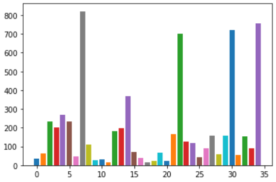

# TaiwanRainAVG

1.從氣象開放資料平台連接其API，本次使用資料為「每日雨量-局屬地面測站每日雨量資料」，網址：https://opendata.cwb.gov.tw/dist/opendata-swagger.html#/

2.使用Python進行基本分析與資料處理

3.本資料夾網址：https://github.com/stephenwen39/TaiwanRainAVG

4.資料彙整如下：

此為每個測站之2021年一至四月的總雨量比較圖，可以看到有四個測站的雨量總和大幅度高於其他測站，累計雨量大於650mm

而此四個測站分別為 宜蘭蘇澳測站，台北鞍部測站，台北竹子湖測站，基隆測站

可以發現皆位於北北基地區與宜蘭等北部地區。

而若將焦點移至雨量少於50mm的測站，如下所示:

澎湖測站，雲林測站，屏東恆春測站，高雄測站，嘉義測站，彰化田中測站，屏東測站，東吉島測站，台南測站，彰化測站

可以發現皆為本次缺水最嚴重的幾個地區

顯示降雨資料與缺水區域吻合
