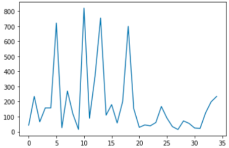

# TaiwanRainAVG

1.從氣象開放資料平台連接其API，本次使用資料為「每日雨量-局屬地面測站每日雨量資料」，網址：https://opendata.cwb.gov.tw/dist/opendata-swagger.html#/

2.使用Python進行基本分析與資料處理

3.本資料夾網址：https://github.com/stephenwen39/TaiwanRainAVG

4.資料彙整如下：

此為每個測站之2021年一至四月的總雨量比較圖，可以看到有四個測站的雨量總和大幅度高於其他測站
